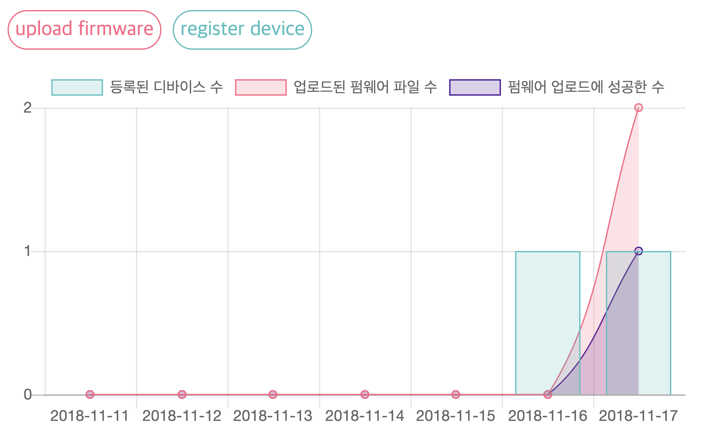

# BISS Firmware Server


펌웨어 업로드 및 디바이스 펌웨어 업데이트

# 설치
```bash
$ git clone https://github.com/LAB-C/BISS-FirmwareServer
$ cd BISS-FirmwareServer
$ git submodule update --init --recursive
$ pip3 install -r requirements.txt
```

# 워크플로우

## 1. 디바이스 정보 등록
- Register device information(`name`, `wallet`) -> table `Device`
- Web: `/register`

## API

### Check existence
POST, `Content-Type: application/json`, `/api/check/exist`

서버에 해당 wallet이 존재하는지 확인한다.

#### Request

```json
{
    "wallet": "0x75a59b94889a05c03c66c3c84e9d2f8308ca4abd"
}
```

| 이름        | 타입      | 설명            |
| :--------- | :------- | :------------- |
| `wallet`   | `string` | Klaytn 지갑 주소 |

#### Response

```json
{
    "exist": false
}
```

| 이름     | 타입     | 설명            |
| :------ | :------ | :------------- |
| `exist` | `bool`  | `wallet`이 DB에 존재하는 경우 `true`, 아닐 경우 `false` |

### Register device
POST, `Content-Type: application/json`, `/api/register`

`name`을 이름으로 하고 Klaytn 지갑 주소 `wallet`을 지니는 디바이스를 등록합니다.

#### Request

```json
{
    "name": "somedevice1", 
    "wallet": "0x75a59b94889a05c03c66c3c84e9d2f8308ca4abd"
}
```

| 이름        | 타입      | 설명            |
| :--------- | :------- | :------------- |
| `name`     | `string` | 디바이스 이름     |
| `wallet`   | `string` | 디바이스 Klaytn 지갑 주소 |

#### Response

- 정상 처리 시:

```json
{
    "success" : {
        "name": "somedevice1", 
        "wallet": "0x75a59b94889a05c03c66c3c84e9d2f8308ca4abd"
    }
}
```

- 에러 발생 시:

```json
{
    "error": "Not valid wallet address"
}
```

> 추후 수정 방법:
> ```json
> {
>     "success" : true,
>     "name": "somedevice1", 
>     "wallet": "0x75a59b94889a05c03c66c3c84e9d2f8308ca4abd"
>
> },
> {
>     "success" : false,
>     "error": "Not valid wallet address"
> }
> ```

| 이름       | 타입      | 설명            |
| :-------- | :------- | :------------- |
| `success` | `bool`   | 성공 여부        |
| `name`    | `string` | 디바이스 이름     |
| `wallet`  | `string` | 디바이스 Klaytn 지갑 주소 |
| `error`   | `string` | 에러 메세지      |

## 2. 펌웨어 업로드, 업로드할 디바이스 선택
- Upload firmware file, choose devices 
- Web: `/upload`

## 3. 블록체인에 랜덤 키 넣고 전송, DB에 파일 키와 URL, 해시 저장
Put random key(`utils.random_key()`) in blockchain, save `key`/`route`(route is URL location in server)/`filehash` in DB -> table `File`

## 3. receipt가 돌아오면 txHash를 해당 row에 추가
Append `txHash` in current file row when `receipt` returns

## 4. 서버가 file_id, txHash를 업데이트 대상인 디바이스 API에 업데이트
Server sends `txHash`, `file_id` to client API(client checks updates with certain time)

- 각 디바이스는 자신의 인증 정보를 이용하여 일정 시간마다 업데이트 사항이 있는지를 체크

### API
POST, `Content-Type: application/json`, `/api/check/update`

```json
{
    "wallet": "0x75a59b94889a05c03c66c3c84e9d2f8308ca4abd"
}
```

## 5. 디바이스가 public URL을 구해 다운로드
Client uses `file_id` and `txHash` to get public URL and can download file

- txHash를 통해서 해당 블록의 데이터(key)를 얻어 file_id와 함께 서버로 보내 public URL을 구함
- 해당 URL을 이용해서 펌웨어 파일을 다운로드 받을 수 있음

### API
POST, `Content-Type: application/json`, `/api/download/<file_id>`

```json
{
    "key": "dzuR5AVP0KCd0GVJnC5lYTUhCWcCuP"
}
```

## 6. 디바이스에서 파일 해싱, 서버의 값과 대조
Client hashes recived file and check with hash in server DB

- 디바이스에서 다운로드한 파일의 해시값과 서버에 있는 파일의 해시값을 비교
- 이때 비교 결과가 True여야 success 로그가 남음(나중에 7단계로 옮기자)

### API
POST, `Content-Type: application/json`, `/api/check/hash/<file_id>`

```json
{
    "hash": "4e6e424c9e2c7ff4386616cba7bd6b8f",
    "wallet": "0x75a59b94889a05c03c66c3c84e9d2f8308ca4abd"
}
```

## 7. 다 잘 되면 펌웨어 업데이트
When everything is perfect, Client updates firmware (AND PROFIT!!! ~~at last~~)
